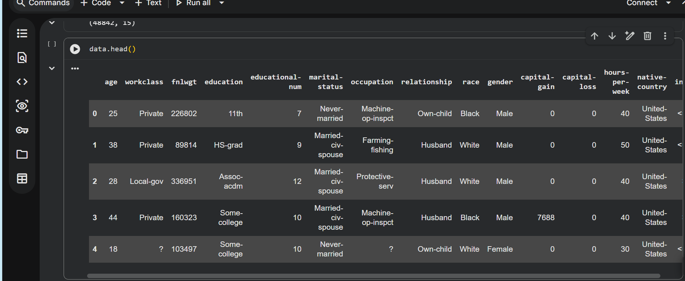
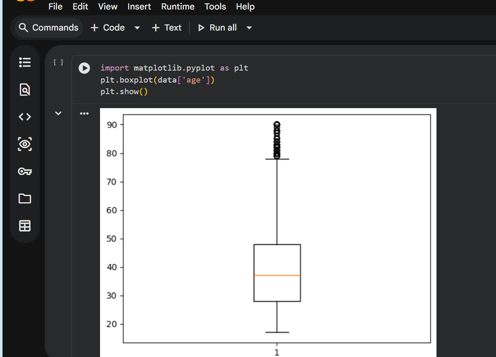
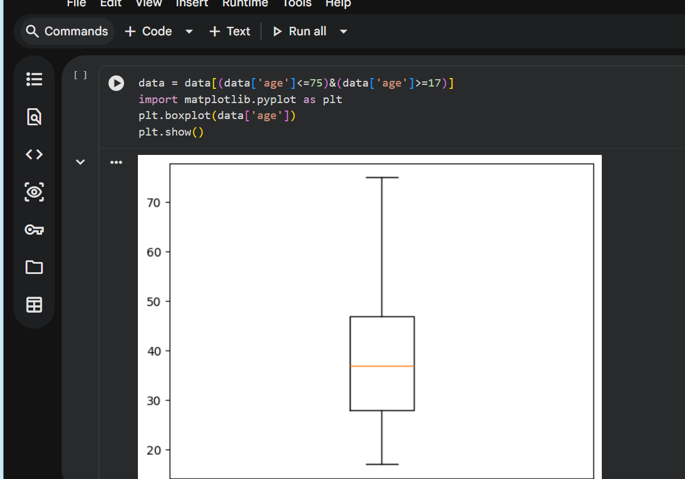
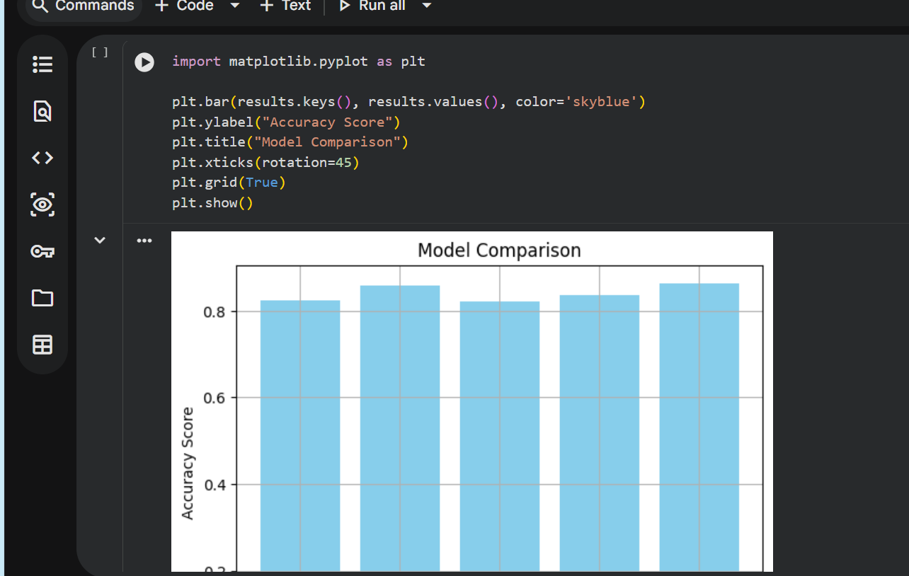
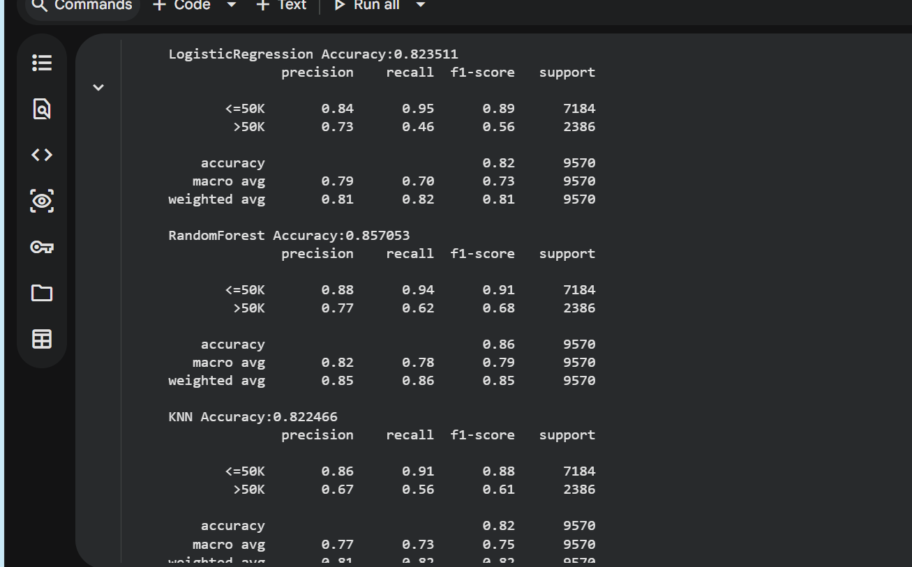
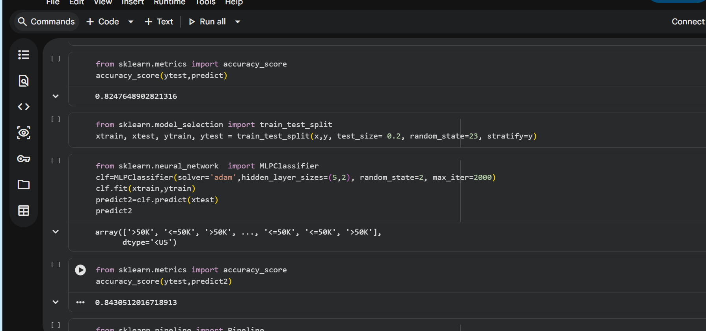
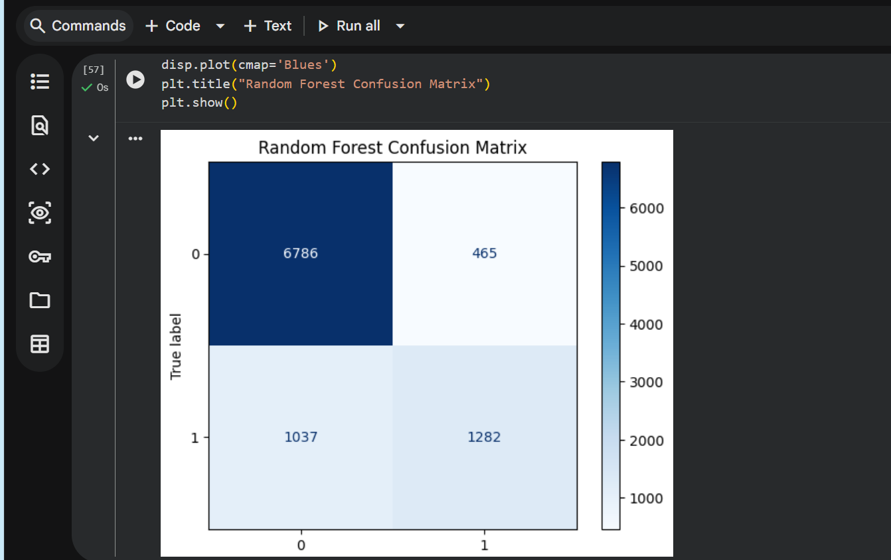

# Employee Income Predictor

## Project Overview

The Employee Income Predictor is a Machine Learning project that predicts whether an employee earns more than **50K** or less than or equal to **50K** annually using demographic and employment-related information.

The project is built using the Adult Census Income Dataset and compares multiple machine learning algorithms to determine the best-performing model.

---

## Features

- Data Cleaning
- Data Preprocessing
- Outlier Detection
- Feature Scaling using MinMaxScaler
- Train-Test Split
- Multiple Machine Learning Models
- Model Comparison
- Accuracy Evaluation
- Classification Report
- Income Prediction

---

## Technologies Used

- Python
- Pandas
- NumPy
- Matplotlib
- Scikit-learn
- Google Colab
- GitHub

---

## Dataset

Dataset: Adult Census Income Dataset

Target Variable:

- <=50K
- >50K

---

## Machine Learning Models Used

- Logistic Regression
- Random Forest
- K-Nearest Neighbors (KNN)
- Multi Layer Perceptron (Neural Network)

---

## Project Structure

Employee-Income-Predictor/

```
dataset/
images/
models/
notebook/
report/
src/

README.md
requirements.txt
LICENSE
```

---

## Results

The project compares different machine learning algorithms.

Random Forest achieved the highest accuracy among the implemented models.

---

## Screenshots

### Dataset Preview



---

### Age Distribution Before Removing Outliers



---

### Age Distribution After Removing Outliers



---

### Model Comparison



---

### Model Evaluation



---

### Neural Network Accuracy



---

### Confusion Matrix



---

## Installation

Clone the repository

```bash
git clone https://github.com/Shravanigs09/Employee-Income-Predictor.git
```

Install dependencies

```bash
pip install -r requirements.txt
```

Run the notebook

```
notebook/edunet.ipynb
```

---

## Future Improvements

- Deploy using Streamlit
- Hyperparameter Tuning
- Improve Prediction Accuracy
- Save the trained model using Pickle

---

## Author

Shravani G S

Computer Science Engineering (AI & ML)

GitHub:
https://github.com/Shravanigs09
